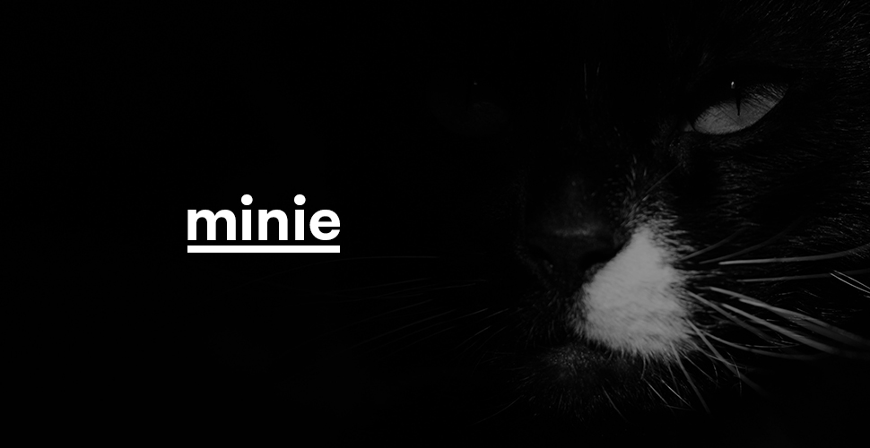

<br>



<br>

    Yet another simple string compressor

`npm i minie` / `yarn add minie`

[](https://www.npmjs.com/package/minie)
[](https://www.npmjs.com/package/minie)

Minie's name comes from the name of our rescued cat (she came with her name).

### What is `minie`?
- Two methods: `compress` & `decompress`.
- You pass in a string, you get a shorter string.

### Gotchas
- The method `compress` is not a pure function. Compressing several times the same input won't return the same output.
- The method `decompress` is a pure function. Decompressing several times the same input will return the same output.

# Get started
```js
import { compress, decompress } from 'minie';

const str = JSON.stringify({
            widget: {
                debug: 'on',
                window: {
                    title: 'Sample Konfabulator Widget',
                    name: 'main_window',
                    width: 500,
                    height: 500,
                },
                image: {
                    src: 'Images/Sun.png',
                    name: 'sun1',
                    hOffset: 250,
                    vOffset: 250,
                    alignment: 'center',
                },
                text: {
                    data: 'Click Here',
                    size: 36,
                    style: 'bold',
                    name: 'text1',
                    hOffset: 250,
                    vOffset: 100,
                    alignment: 'center',
                    onMouseUp: 'sun1.opacity = (sun1.opacity / 100) * 90;',
                },
            },
        });

const compressed = compress(str);
// => '🐈BÐ* sďć§#$ÂÕdn$T3ÊńmÝØmüm&z_¾tg_7ĶKĞĒ±YÝoÛp§òĐŃ¼Jûs,ħL¾Ø¾ĤàĎ%~ð0IíJĕĝ©$X%#Ďªė¦~ďĎIÌ\x7FģKb[7rÆ]Ě©ìu;ĊĠģOÆÙR`\x81|¿b{-fìAįºxlĭĖßã¨{đ5ñzËŀJͨĐûČEĨ·Ø®TÕ\\ħ§ë8ðŃêݧÞĶ·ĒéĔ6êáXĩÖ{fĐ)ÓąŁÉ¤ŀÚwuŁµĴ±ŀDAµgëhŀĒıð°ăêĢĴ«pµĿ;}āńéóďYÄémŃüĬÕFă1ÌĎ:¦sòp^¶JēqĹuSĩ\x7F\x7FÍàį9ī¾Ń!ęöć-Ê!  '

const decompressed = JSON.parse(decompress(compressed));
/*
  => {
        widget: {
            debug: 'on',
            window: {
                title: 'Sample Konfabulator Widget',
                name: 'main_window',
                width: 500,
                height: 500,
            },
            image: {
                src: 'Images/Sun.png',
                name: 'sun1',
                hOffset: 250,
                vOffset: 250,
                alignment: 'center',
            },
            text: {
                data: 'Click Here',
                size: 36,
                style: 'bold',
                name: 'text1',
                hOffset: 250,
                vOffset: 100,
                alignment: 'center',
                onMouseUp: 'sun1.opacity = (sun1.opacity / 100) * 90;',
            },
        },
    }
*/


// That's about it.
```
